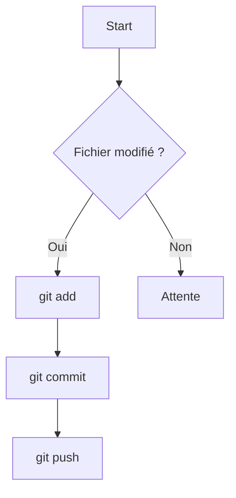
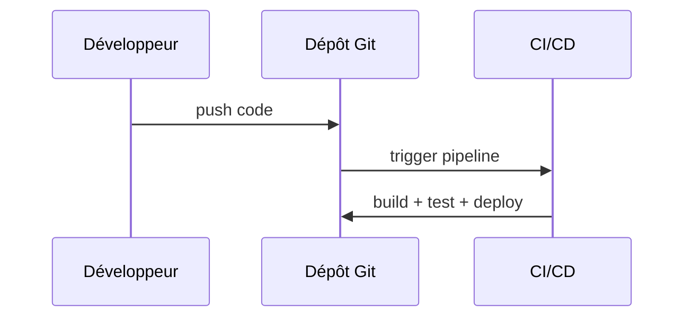
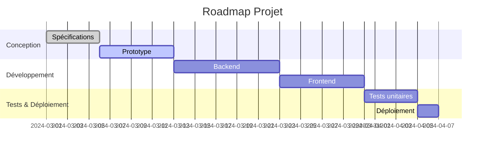
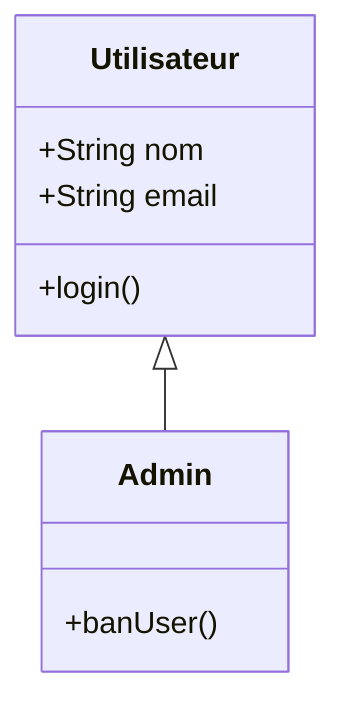
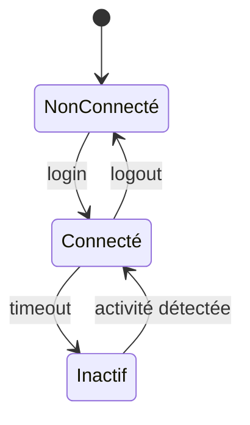
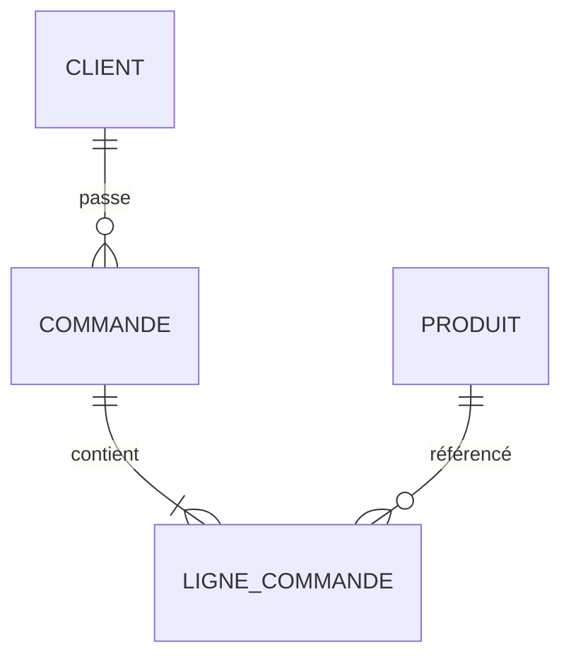

# 🧠 Exemples de diagrammes Mermaid

---

## 1. Diagramme de flux (Flowchart)

---

## 2. Diagramme de séquence (Sequence Diagram)

---

## 3. Diagramme Gantt (Gantt Chart)

---

## 4. Diagramme de classes (Class Diagram)

---

## 5. Diagramme d’états (State Diagram)

---

## 6. Diagramme ERD (Entity Relationship Diagram)

