# 🧠 Exemples de diagrammes Mermaid

---

## 1. Diagramme de flux (Flowchart)

```mermaid
graph TD
  Start --> Decision{Fichier modifié ?}
  Decision -- Oui --> Stage[git add]
  Stage --> Commit[git commit]
  Commit --> Push[git push]
  Decision -- Non --> End[Attente]
```

---

## 2. Diagramme de séquence (Sequence Diagram)

---

## 3. Diagramme Gantt (Gantt Chart)

---

## 4. Diagramme de classes (Class Diagram)

---

## 5. Diagramme d’états (State Diagram)

```mermaid
stateDiagram-v2
  [*] --> NonConnecté
  NonConnecté --> Connecté : login
  Connecté --> NonConnecté : logout
  Connecté --> Inactif : timeout
  Inactif --> Connecté : activité détectée
```

---

## 6. Diagramme ERD (Entity Relationship Diagram)

