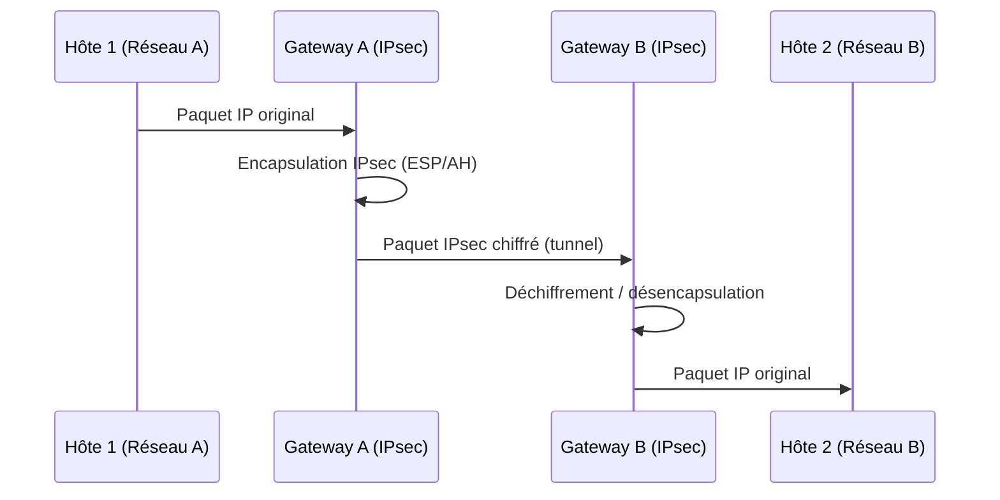
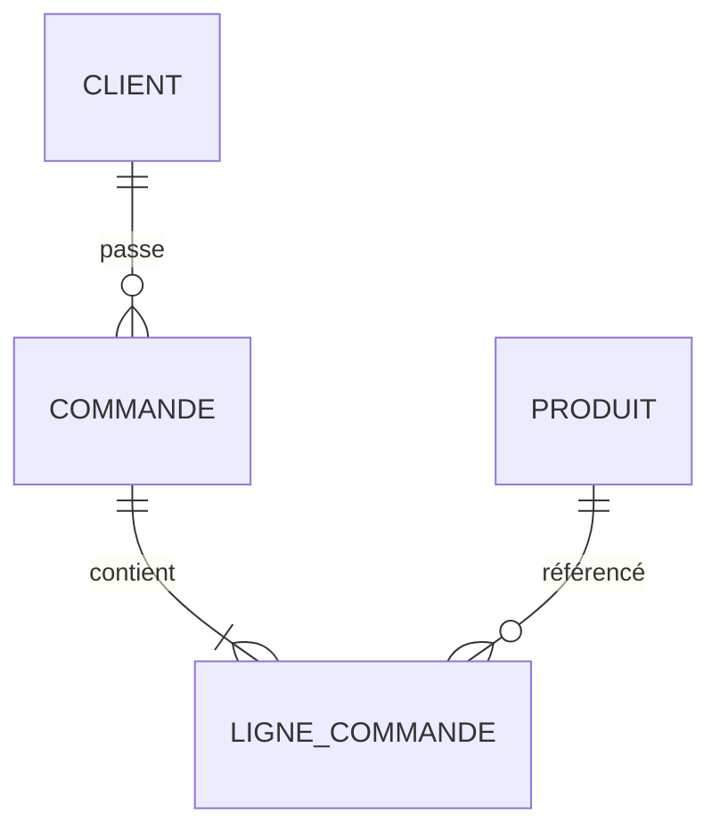
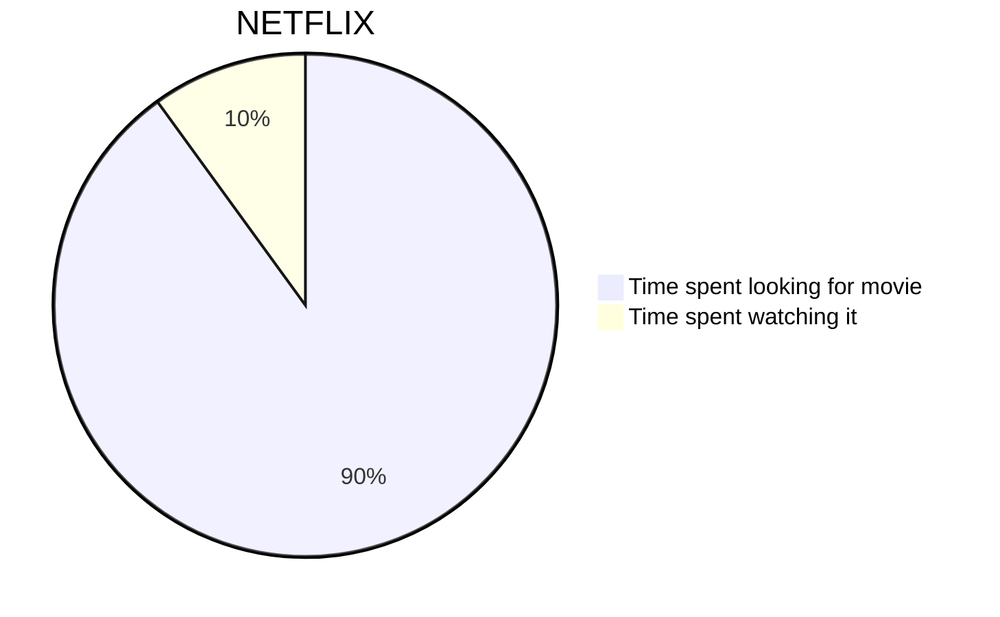
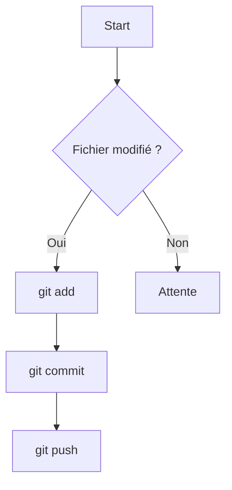
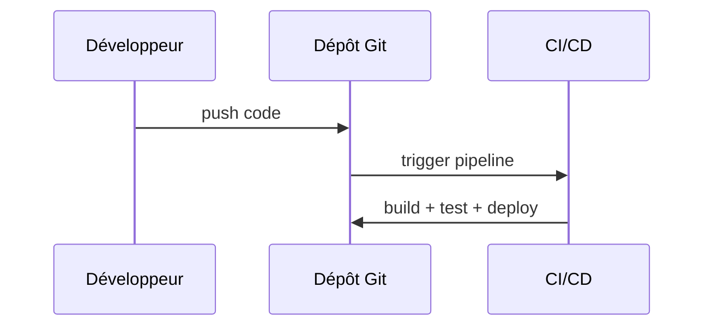
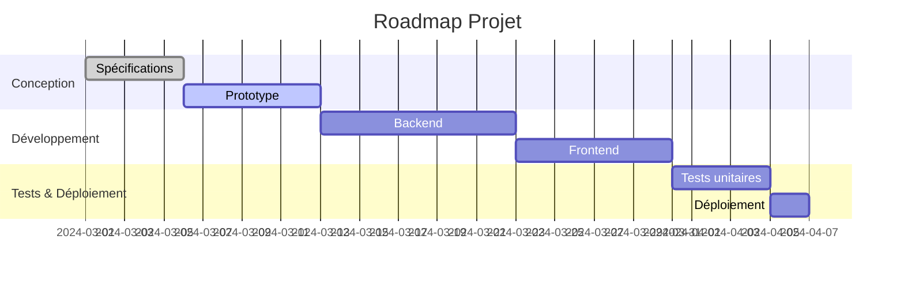
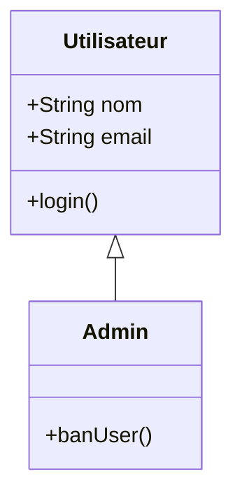
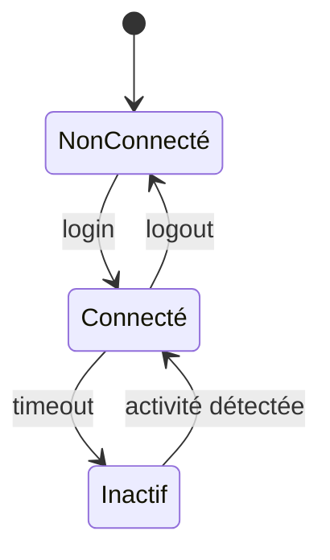

```mermaid
sequenceDiagram
  participant H1 as Hôte 1 (Réseau A)
  participant GW1 as Gateway A (IPsec)
  participant GW2 as Gateway B (IPsec)
  participant H2 as Hôte 2 (Réseau B)

  H1->>GW1: Paquet IP original
  GW1->>GW1: Encapsulation IPsec (ESP/AH)
  GW1->>GW2: Paquet IPsec chiffré (tunnel)
  GW2->>GW2: Déchiffrement / désencapsulation
  GW2->>H2: Paquet IP original
```


```mermaid
graph TD;
    A-->B;
    A-->C;
    B-->D;
    C-->D;
```


```mermaid
erDiagram
  CLIENT ||--o{ COMMANDE : passe
  COMMANDE ||--|{ LIGNE_COMMANDE : contient
  PRODUIT ||--o{ LIGNE_COMMANDE : référencé

```


```mermaid

pie title NETFLIX
         "Time spent looking for movie" : 90
         "Time spent watching it" : 10
```

## Suivant


```mermaid
graph TD
  Start --> Decision{Fichier modifié ?}
  Decision -- Oui --> Stage[git add]
  Stage --> Commit[git commit]
  Commit --> Push[git push]
  Decision -- Non --> End[Attente]
```



```mermaid
sequenceDiagram
  participant Dev as Développeur
  participant Git as Dépôt Git
  participant CI as CI/CD

  Dev->>Git: push code
  Git->>CI: trigger pipeline
  CI->>Git: build + test + deploy
```



```mermaid
gantt
  title Roadmap Projet

  section Conception
  Spécifications      :done,    des1, 2024-03-01, 5d
  Prototype           :active,  des2, 2024-03-06, 7d

  section Développement
  Backend             :         dev1, after des2, 10d
  Frontend            :         dev2, after dev1, 8d

  section Tests & Déploiement
  Tests unitaires     :         test1, after dev2, 5d
  Déploiement         :         dep1, after test1, 2d
```


```mermaid
classDiagram
  class Utilisateur {
    +String nom
    +String email
    +login()
  }

  class Admin {
    +banUser()
  }

  Utilisateur <|-- Admin

```


```mermaid
stateDiagram-v2
  [*] --> NonConnecté
  NonConnecté --> Connecté : login
  Connecté --> NonConnecté : logout
  Connecté --> Inactif : timeout
  Inactif --> Connecté : activité détectée
```


````
Fin
````